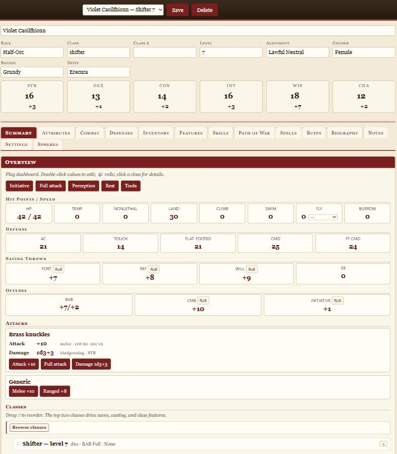
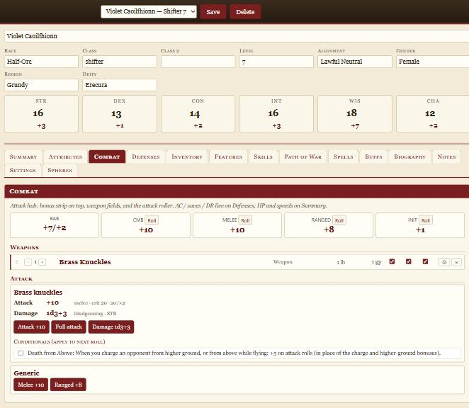
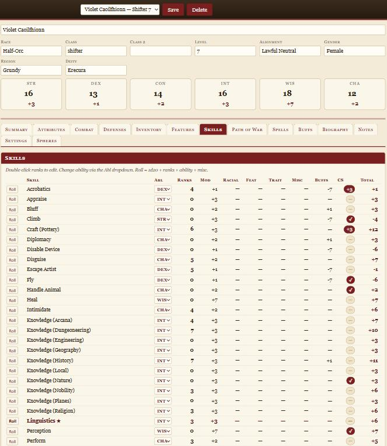
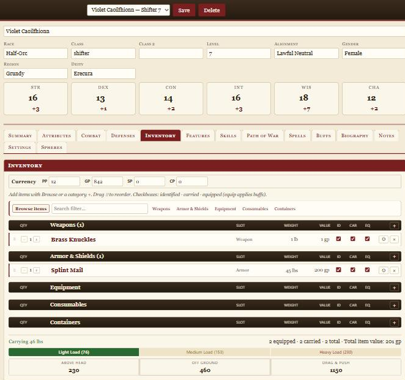
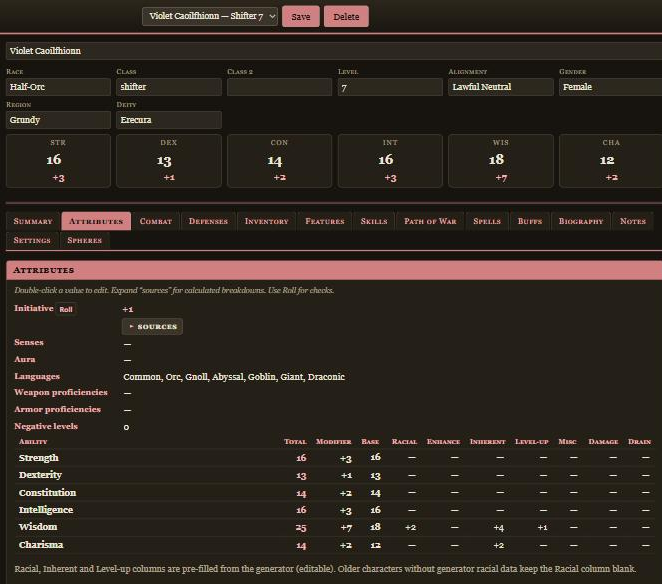

# Pathfinder 1E Character Sheet

A browser-based, FoundryVTT-style character sheet for Pathfinder 1st Edition — generate a
random NPC or load an existing one, then play from it. No install, no login; everything runs
in your browser and saves locally.

### ▶ [**Open the live sheet**](https://the-data-is-a-lie.github.io/Pathfinder-Character-Sheet/)



## Features

- **Full PF1 statblock** across FoundryVTT-style tabs — Summary, Attributes, Combat, Defenses,
  Inventory, Features, Skills, Path of War, Spells, Buffs, Biography, Notes.
- **Everything is live-calculated** — HP, AC, saves, attacks, CMB/CMD and skills recompute from
  ability scores, gear, feats and buffs; expand *sources* on any value to see the math.
- **Inventory with Foundry-style item sheets** — grouped item table, currency, encumbrance, and
  equipped gear that feeds the character's numbers.
- **Path of War & Spheres of Power** — maneuvers, readied/stance toggles, spell casting with
  roll-log cards, and a buffs/conditions ledger that drives every derived number.
- **Dice roller with sound** — roll attacks, saves and skills from the sheet or the Tools drawer.
- **15+ light & dark themes** plus a custom-theme builder (WCAG-checked); deep-link a look with
  `?theme=dusk`.
- **Local character library** — stored in-browser (IndexedDB), with optional sync to a real disk
  folder (Chrome/Edge). Print-friendly output too.

### Screenshots

| Combat | Skills |
| :---: | :---: |
|  |  |
| **Inventory** | **Attributes** (Dusk theme) |
|  |  |

## Random character generator

Character **generation** is powered by the companion
[Pathfinder 1E Randomized Character Generator](https://github.com/The-Data-is-a-lie/Pathfinder_Char_Creator).
Hit **Generate** and the sheet posts your options to the generator's backend (defaulting to a
free hosted instance), which returns a complete character that the sheet renders and auto-saves.
Point it at your own backend from **Settings** or with `?backend=…`. Already have a character?
Use **Load JSON** to open a saved export — no backend needed.

> The hosted generator backend sleeps when idle, so the first **Generate** after a quiet spell can
> take up to a minute to wake. Loading a saved character is instant.

## Run locally

It's a static site — serve the folder over HTTP (not `file://`, since it fetches `data/*.json`):

```
python -m http.server 8080     # then open http://localhost:8080/
```
